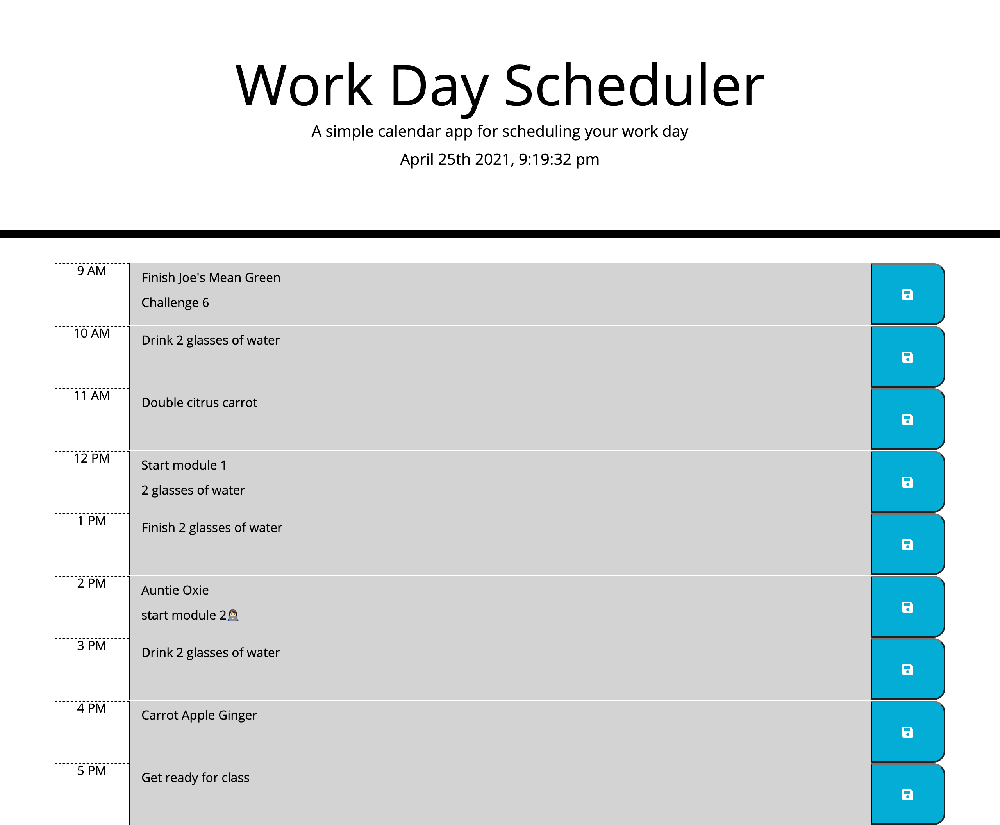

# work-day-scheduler

#Description:

Created a calendar application that allows a user to save events from 9am to 5pm! 

#Frameworks

This app runs in the browser and features dynamically updated HTML and CSS powered by jQuery and Bootstrap.

- Added current date and time at the top of the page 
- Colors change when it is past, present, and future depending on current hour of the day
- When notes are saves, you're able to refresh page and saved notes will still be there

Links & Images:

Link to Work Day Scheduler: https://salask24.github.io/work-day-scheduler/
Link to github repo: https://github.com/salask24/work-day-scheduler

